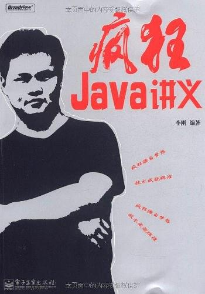  
(https://book.douban.com/subject/3246499/)  
###java疯狂讲义  
###本人第一本入门java的书，图书馆靠着续借借了1年多，啃完第三版，后来买了第四版当做工具书。\
###该书对java基础来说介绍的相当全面，例子也很生动，对于当时什么都不懂的我来说，给我的帮助大概有以下几点：1.举例子生动形象，便于新人记忆；2.大量的代码示例可供参考；3.让我学会思考，例如：hashmap用在什么地方，优缺点，有什么替代方案等。  
当然，正是因为本书太过于全面，涵盖了java当中的方方面面，它的优点也是一种缺点，技术全都尽力介绍清楚，导致每一章的内容都很满，容易让人分不清楚主次，例如awt和swing就没必要再去学习了，另外也有很多技术细节也没点清楚，但是对新手来说书中的知识入门也已经足够了。  

---
---
  
(https://book.douban.com/subject/2243615/)  
###Head First 设计模式  
设计模式入门书，例子相当生动，先引出一个实际场景，再引导读者深入去优化代码结构，从而引申出设计模式的思想，有助于读者理解其中思想。从事软件开发完全有必要一读。  
缺点也是有的，图文并茂厚厚的一本，大量的插图，十几行文字就结束一页纸，看似厚厚的一本，实质内容也没多少，但是思想确是相当精髓，要是觉得时间宝贵也可以看博客上面别人总结的，不过可能没看完本书学得深刻。另外举的例子用的外国笑点，可能是因为中外环境差异，本人完全get不到，反而觉得有些无趣。  
head first系列丛书口碑都是不错的，入门书可以考虑下这个系列。  

---
---
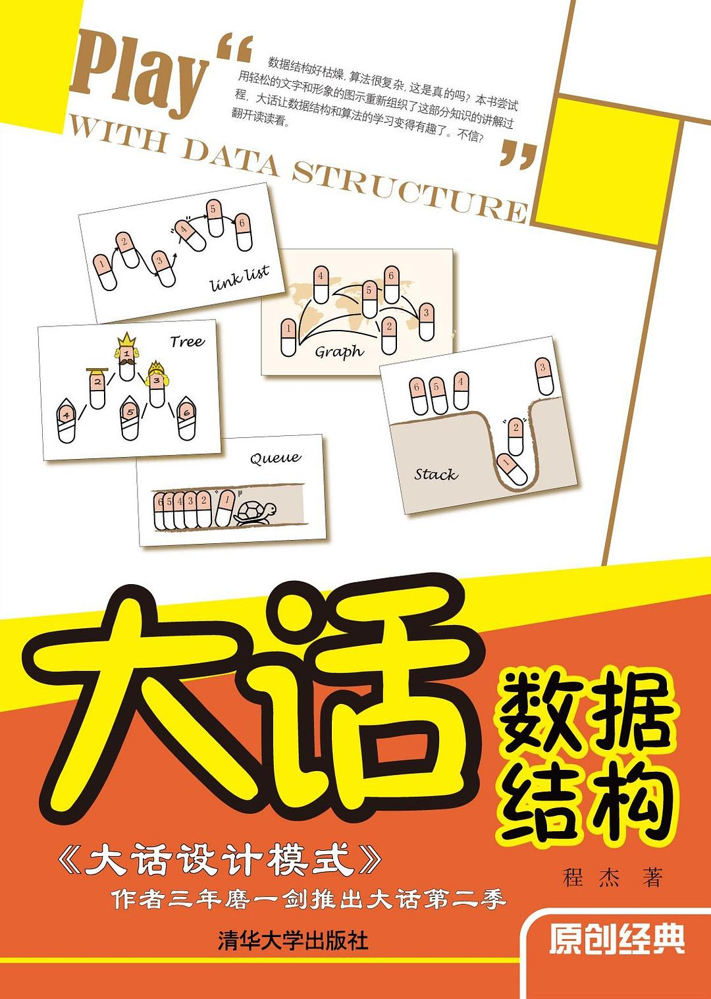  
(https://book.douban.com/subject/6424904/)  
###大话数据结构  
对于初学者，数据结构对很多人简直是噩梦一般的存在，本人刚学的时候刷了几遍教材还是不理解能用到什么地方。这本书是本人大学时期数据结构老师推荐的，我只是简单看过几页，身边看完的同学都说不错，和head first的风格有点像，用日常生活中的事物举例子，便于理解，数据结构的教材学不懂的话，看这本书还是不错的。  
本人学数据结构也挺波折的，原来老师讲的完全听不懂，后面做项目，做着做着就懂了，当然也有一些对基本数据结构使用上的困惑，这时候再回过头来看，就觉得很轻松了。加上后面学HashMap原理和MySQL索引的原理，就越来越发现数据结构的重要性了。  

---
---
  
(https://book.douban.com/subject/33420587/)  
###小灰的算法之旅  
提到数据结构就不得不提算法。把软件设计当做盖大楼的话，数据结构就是实体的一块块砖头，算法就是砌砖的手段，砖头固然重要，但是砌砖的手法，也决定了大楼最后能搭多高。  
这是本人看公众号刷到的一本书，只看过几页，通过漫画的介绍算法，对于算法苦恼或者想了解下算法的同学可以看一看。不过本书也仅限于入门，要是数学好的话可以直接刷LeetCode，或者算法导论直接刷重点。java有一定基础的同学可以直接看jdk的源码，其中蕴含很多优秀的算法设计在里面。  

---
---

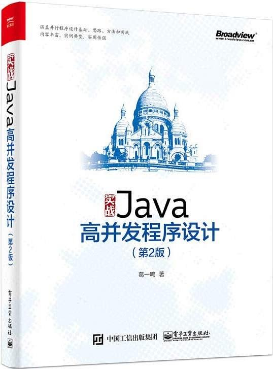  
(https://book.douban.com/subject/26663605/)  
###Java高并发程序设计  
并发入门很好的一本书，但很多都是介绍概念，浅尝辄止，并未做过多深入的探讨，不过还是十分推荐的。这本书虽然叫高并发程序设计，但是书的内容和深度决定了它更适合当一本入门书，若是需要深入研究并发，这本书就不太适合了。  
本书的插图全是作者手绘，有些流程图和手绘的文字真的看不太懂，需要靠猜测和推理来理解，还是给阅读体验造成了一点影响的。  

---
---
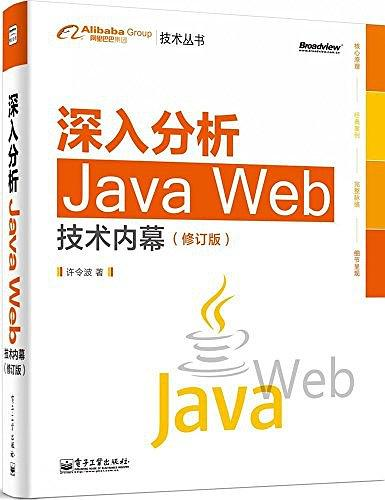  
(https://book.douban.com/subject/25953851/)  
###深入分析Java Web技术内幕  
学生时期看的，对本人最有帮助的是class文件的结构这一章的内容，这些底层的知识的确实给那时候的我眼前一亮的感觉。  
本书个人感觉偏向于入门进阶级别，作者把整套web流程需要用到的知识点都在书中提到，把其它一些书籍的重要部分汇总成这一本书。这样问题也来了，一些编码部分和web请求的流程，学过计算机网络的就会觉得内容有些重复。本书阅读方式个人感觉就当看学霸笔记一样，直接看目录章节，哪里不会看哪里。  

---
---
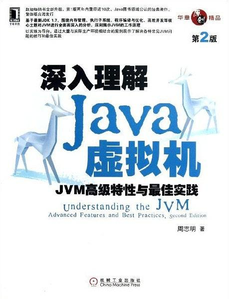  
(https://book.douban.com/subject/24722612/)  
###深入理解Java虚拟机  
相当优秀的一本书，有知识深度，干货满满，确实做到了深入理解JVM。通过本书代码示例和推荐工具，结合自己日常java开发来思考，确实受益匪浅。  

---
---
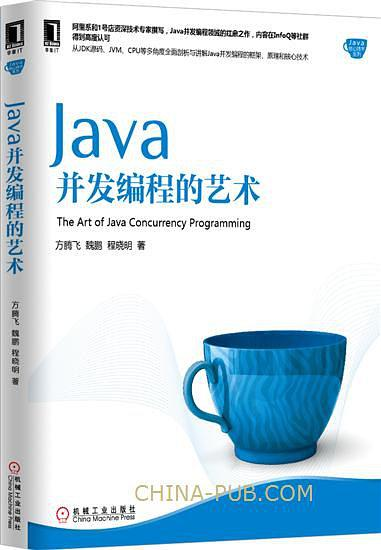  
(https://book.douban.com/subject/26591326/)  
###Java并发编程的艺术  
抽重点看的，本人着重看了并发容器和框架介绍部分，这部分对于提升自己眼界还是有帮助的。由于其他内容有另外的学习途径，就粗略地浏览了一遍，书中对concurrent包下的内容也只是入门，不够深入，直接看concurrent包的源码会更好些。书中对volatile的解释缺了点东西，感觉只是生硬地翻译标准文档。  

---
---
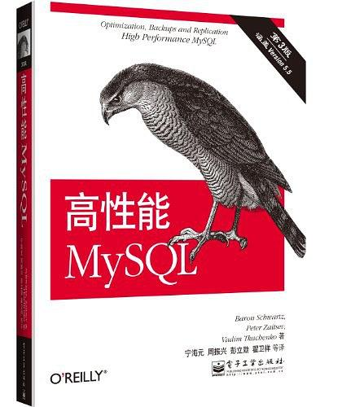   
(https://book.douban.com/subject/23008813/)  
###高性能MySQL  
数据库进阶好书，建议有一定的MySQL基础再看，干货很多，常读常新，性能优化部分足够解决工作中遇到的大部分问题。使用此书的同时建议配合MySQL官方文档一起看。本书MySQL索引部分没有提到的MySQL索引底层实现原理也可另外找时间深入研究。  
切记，至少要看第三版，第二版的翻译口碑不行。  

---
---
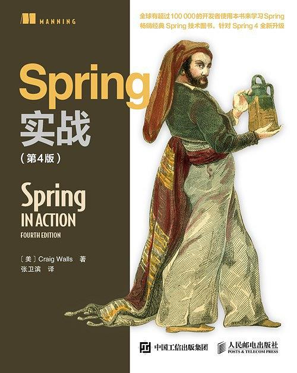    
(https://book.douban.com/subject/26767354/)  
###Spring实战  
本书建议有一定的Spring基础再看，本人拿此书入门Spring完全看不懂。框架书最麻烦的是技术迭代，导致书中旧的技术不适用现今的潮流，一些过时的东西也容易误导读者，不过框架的核心原理却是万变不离其宗的，所以建议有spring基础挑有用的部分看，就足够了。  

---
---
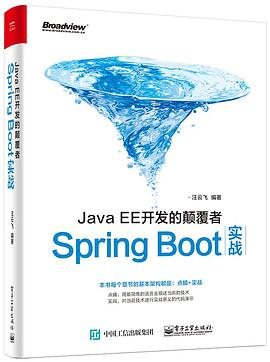  
(https://book.douban.com/subject/26762595/)  
###JavaEE开发的颠覆者  
书中贴满代码的书籍，可买可不买。有项目经验的直接看Spring Boot官网的入门引导个人认为会更好一些。没有Spring经验和项目经验，想用Spring Boot速成一个项目看这本书还是可以的，有Spring经验的还是看Spring Boot的官方文档吧。  

---
---
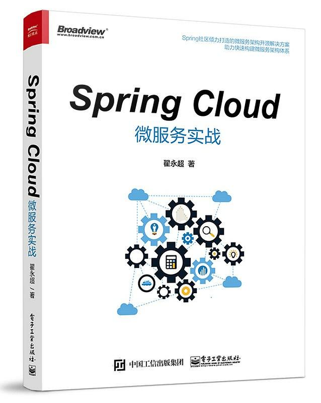  
(https://book.douban.com/subject/27025912/)  
###Spring Cloud微服务实战  
本书Spring Cloud选用的组件已经是很老的版本了，用最新的Spring Cloud组件照着书上的内容改造一遍也是不错的选择，github也已经有大佬总结了很全面的Spring Cloud学习路径了，看哪种方式更适合你吧。

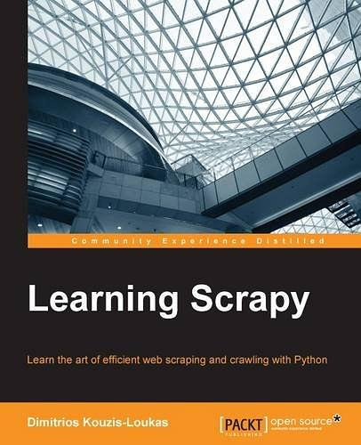  
(https://book.douban.com/subject/26708820/)  
###Learning Scrapy  
学爬虫入门相当不错的选择，本书技术选型Python2.7，Scrapy 1.0.3框架，最好搭个梯子配合使用。没有梯子，国内崔庆才老师的爬虫视频教程也是不错的选择。  

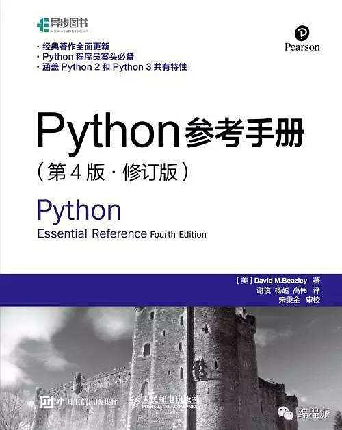  
(https://book.douban.com/subject/26708820/)  
###Python参考手册 第4版 修订版  
当做python线下速查手册，感觉还不错  

---
---
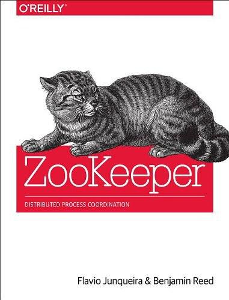   
(https://book.douban.com/subject/25765743/)  
###ZooKeeper  
中文版翻译不太行，建议有条件的看英文版  

---
#正在看  
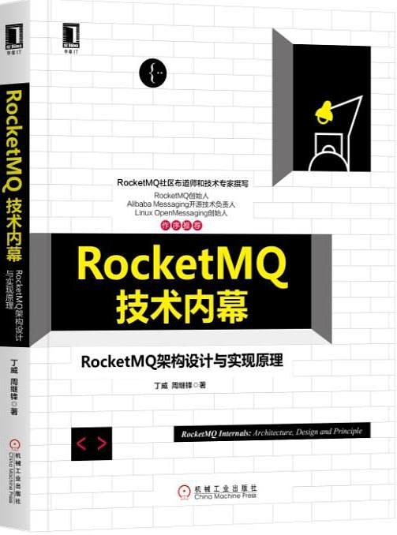  
(https://book.douban.com/subject/30417623/)  
###RocketMQ技术内幕  

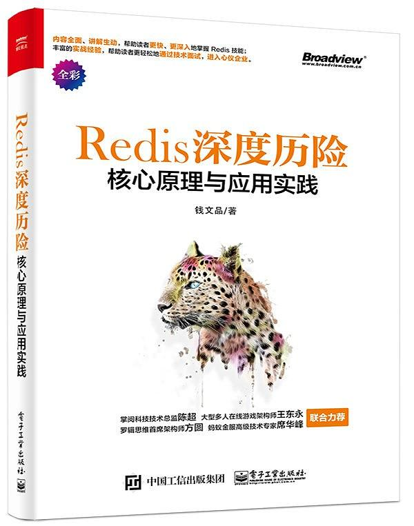  
(https://book.douban.com/subject/30386804/)   
###Redis 深度历险：核心原理与应用实践  

---
#备用书库  
机器学习（周志华）  
NIO与Socket编程技术指南  
TCP协议三卷  
分布式服务架构 原理、设计与实战  
Apache Dubbo与实战  
Python自然语言处理  
算法导论  
TensorFlow 实战google深度学习框架  
深度学习 21天实战Caffe  
数据算法 Hadoop/Spark大数据处理技巧  
java编程思想  
Java性能优化权威指南 : Java性能优化权威指南  
Java并发编程实战  
Effective java  
Hadoop权威指南
